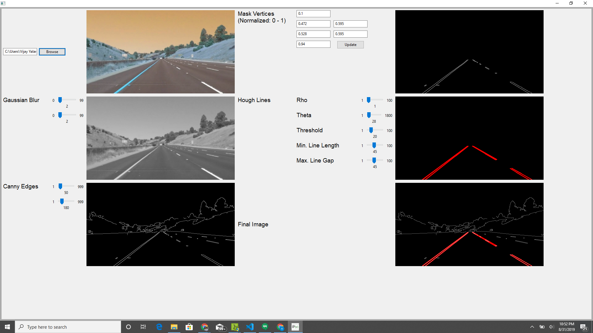

# **Finding Lane Lines on the Road** 

## Writeup Template

### You can use this file as a template for your writeup if you want to submit it as a markdown file. But feel free to use some other method and submit a pdf if you prefer.

---

**Finding Lane Lines on the Road**

The goals / steps of this project are the following:
* Make a pipeline that finds lane lines on the road
* Reflect on your work in a written report

[//]: # (Image References)

[image1]: ./examples/grayscale.jpg "Grayscale"

---

### Reflection

### 1. Pipeline overview.

My pipeline consisted of 7 steps:

#### Step 1: Convert image to gray scale.
-  Reused the helper function provided without any changes.

#### Step 2: Replace yellow pixels with white.
- Identify pixels with yellow color (similar to yellow lane line) and replace with white. This increases the gradient and improves edge detection. This was specially helpful for the challenge problem where the contrast between lane color, road color is not very high.

#### Step 3: Apply Gaussian Blur.
- This helps smooth the image and removes noise. Used helper function without changes.
- kernel_size=5

#### Step 4: Extract edges using 'Canny Edge Detection'
- Use canny helper function to extract edges from blurred image.
- low_threshold = 50, high threshold=180

#### Step 5: Mask region of interest
- Masked image using a trapezoidal shape. The bottom is masked below 10% and above 94% along the horizontal axis. The top is clipped below 47.2% and above 52.8% along the horizontal axis (lane gets narrower). Along the vertical axis, the top 59.7% is masked.
- Used region_of_interest helper function without any changes

#### Step 6a: Detect lines using 'Hough Lines'
- Identify lines using parameters below
> rho=1
> theta=2.8/180.
> threshold=15
> min_line_len=30
> max_line_gap=30

#### Step 6b: Merge left, right lanes lines
- Updated draw_lines() to merge lines before drawing. Merge lines algorithm is explained below:
  - Calculate slope, intercept of lines.
  - Use slope to decide left vs right. Ignore lines with slopes between (-0.45, 0.45).
  - Calculate avergae line slope, intercept weighted by length of each line.
  - Extend lane lines all the way to the bottom of the image.
  - Extend lanes on the top to ensure left, right lanes start at the same height.

#### Step 7: Overlay images

##### Note: Parameters for each function call were arrived at by manual tuning using the GUI shown below. These values were further tuned in Jupyter notebook based on video.

### 2. Identify potential shortcomings with your current pipeline
a) Other line like markings on the road (e.g. tire marks from challenge video around 4 secs) can confuse the algorithm.
b) Curved lanes are not detected very well.
c) Lane detection will not work during lane changes due to region of interest masking.

### 3. Suggest possible improvements to your pipeline
- Additional processing to remove tire markings will improve lane detection. After lines are identified, scan gray scale image surrounding lines to ensure these lines have a minimum thickness. Lane lines should be thicker than tire marks in the grayscale image.
- Lane detected from previous frame could be used to improve lane identification when there is confusion.
